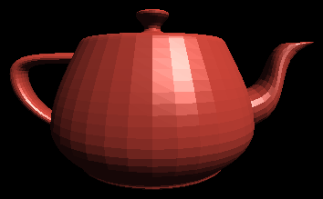
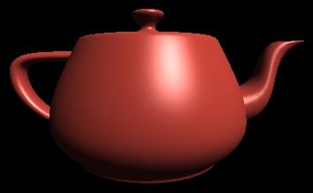
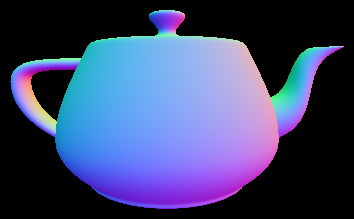

# soft-renderer

A tiny software 3D renderer in Python (numpy + Pillow), with game-style shaders.

### Run
```
pip install -r requirements.txt
python main.py [normals|flat|gouraud|phong] [--mesh teapot.obj] [--size 512] [--out image.png]
```
Without `--out` the image opens in a window.

| Flat | Blinn-Phong | Normals |
|:---:|:---:|:---:|
|  |  |  |

### Shaders
A shader is a class in `softrender/shaders.py` with a `vertex()` and a `fragment()` stage.
`Renderer.draw_triangle(v1, v2, v3, shader, polygon)` runs it. Included: flat,
Gouraud, Blinn-Phong and a normals debug view. Write your own by subclassing `Shader`.

### Tests
```
python -m tests.test_watertight
python -m tests.test_2d_renderer
```
