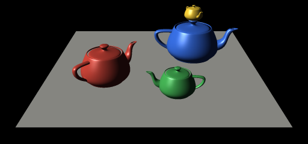
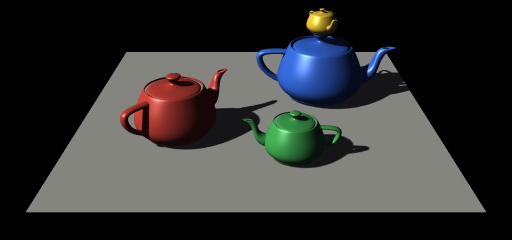

# soft-renderer

A tiny software 3D renderer in Python (numpy + Pillow), with game-style shaders.

### Run
```
pip install -r requirements.txt
python main.py [normals|flat|gouraud|phong] [--mesh teapot.obj | --scene teapots] [--size 512] [--aa 2] [--no-shadows] [--out image.png]
```
Without `--out` the image opens in a window. The camera looks at the mesh from the front and above and moves back until the whole mesh fits the view.

`--aa N` renders at N times the resolution and averages down (supersampling). Edges get smooth, but render time grows as N². Sample images below use `--size 512 --aa 3`, cropped.

| Flat | Blinn-Phong | Normals |
|:---:|:---:|:---:|
|  |  |  |

### Scenes and shadows
A scene is a tree of `Node`s (`softrender/scene.py`). A node has a local transform, optional mesh and
material (shader arguments like `albedo`), and children that move with it. `python main.py --scene teapots`
renders the demo scene from `main.py`: a ground plane and three teapots, with a small teapot parented to
the blue one's lid.

Shadows come from a shadow map (`softrender/shadow.py`): the scene's depth is first rendered from the
directional light with an orthographic camera, then lit shaders check each pixel against it. Edges are
softened with 3x3 PCF. Pass `--no-shadows` to skip it.

| No shadows | Shadow map |
|:---:|:---:|
|  |  |

### Shaders
A shader is a class in `softrender/shaders.py` with a `vertex()` and a `fragment()` stage.
`Renderer.draw_triangle(v1, v2, v3, shader, polygon)` runs it. Included: flat,
Gouraud, Blinn-Phong and a normals debug view. Write your own by subclassing `Shader`.

### Tests
```
pip install -r requirements.txt
pytest
```
Runs everything in `tests/`. A single file runs with `pytest tests/test_watertight.py`, add `-v` to see each test. CI runs the same on every push and pull request.
